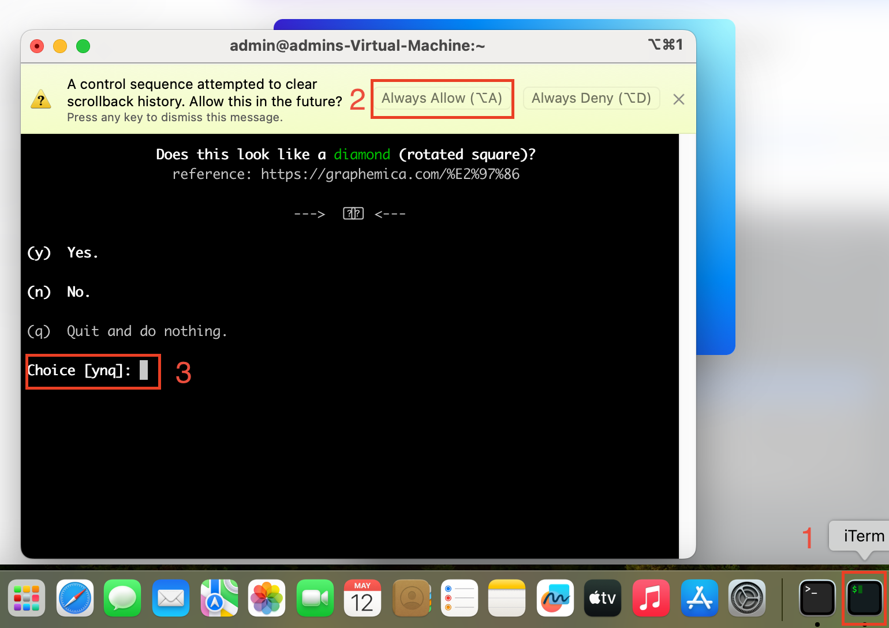
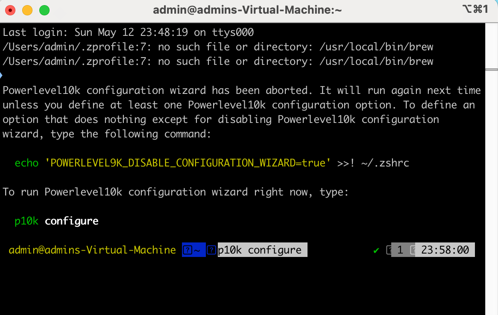
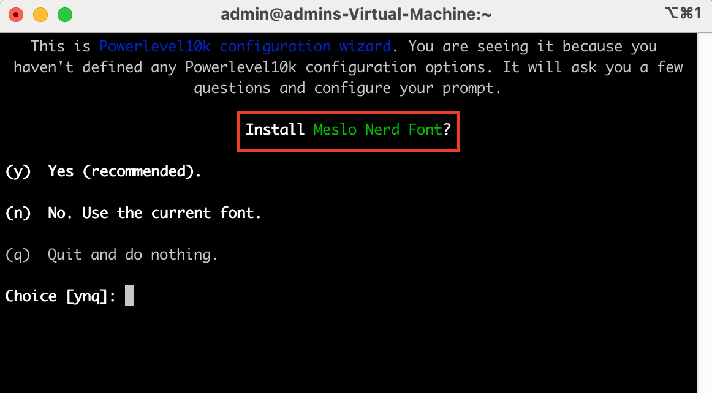

# Скрипты для настройки терминала в MacOS
Репозиторий для статьи [Как настроить консоль (часть 1)](https://medium.com/@anton.smolianin/%D0%BA%D0%B0%D0%BA-%D0%BD%D0%B0%D1%81%D1%82%D1%80%D0%BE%D0%B8%D1%82%D1%8C-%D0%BA%D0%BE%D0%BD%D1%81%D0%BE%D0%BB%D1%8C-%D1%87%D0%B0%D1%81%D1%82%D1%8C-1-7c277cb18443)  
Репозиторий для статьи [Как настроить консоль (часть 2)](https://medium.com/@anton.smolianin/%D0%BA%D0%B0%D0%BA-%D0%BD%D0%B0%D1%81%D1%82%D1%80%D0%BE%D0%B8%D1%82%D1%8C-%D0%BA%D0%BE%D0%BD%D1%81%D0%BE%D0%BB%D1%8C-%D1%87%D0%B0%D1%81%D1%82%D1%8C-2-1f24c54becd4)
## Запуск скрипта
Для начала работы надо склонировать репозиторий и перейти в него. Затем надо запустить *setup.sh*
```
./setup.sh
```
Скрипт запросит пароль администратора, потому что *brew* требует его при установке.
## Что делает скрипт
Лучше конечно самостоятельно прочитати или загнать в ChatGPT потому что не стоит слепо доверять скриптам из интернета, но опишу здесь:
- Скрипт уменьшит интервал между повторениями клавиш. Правда надо будет разлогиниться или перезагрузиться чтобы изменения вступиили в силу
- Скрипт скопирует старые *~/.zshrc* и *~/.zprofile* и добавит к ним суффикс *_old*
- На их место скопирует файлы *zshrc-file* и *zprofile* соответсвенно.
- Далее скрипт установит [brew](https://brew.sh/).
- Затем установит [https://ohmyz.sh/](https://ohmyz.sh/) и тему [powerlevel10k](https://github.com/romkatv/powerlevel10k)
- Затем установит плагин [fast syntax highlighting](https://github.com/zdharma-continuum/fast-syntax-highlighting)
- Затем установит плагин [zsh-autosuggestions](https://github.com/zsh-users/zsh-autosuggestions/blob/master/INSTALL.md)
- Затем установит плагин [fzf](https://github.com/ohmyzsh/ohmyzsh/tree/master/plugins/fzf)
- С помощью *Brewfile* установит [iTerm](https://iterm2.com/), [Amazon Q](https://aws.amazon.com/q/), [fzf](https://github.com/junegunn/fzf) и [fd](https://github.com/sharkdp/fd)
- Запустит iTerm.

## Дополнительные настройки
### iTerm
К сожалению *iTerm* не будет из коробки адекватно показывать *powerlevel10k* промпт. Запустится визард, но из-за того, что нет специальных
шрифтов с иконками можно будет настроить промпт не таким красивым.  
Выход довольно простой.  
Надо прервать *wizard*, нажав `q` и затем заново его запустить:

```
p10k configure
```

Появится предложение установки шрифтов и значит, что можно продолжать:



### Amazon Q
*Amazon Q* надо запустить и зарегистрироваться/залогиниться.
Если приложение не запустилось (скрипт в самом конце должен его запустить).  
Можно выполнить следующую команду.
```
open -a "Amazon Q.app"
```
После этого надо закрыть и окрыть *iTerm*
### Уменьшение интервала между повторениями клавиш
Надо разлогиниться или перезагрузиться. После этого если зажимать стрелочки то перемещаться можно гораздо быстрее.
